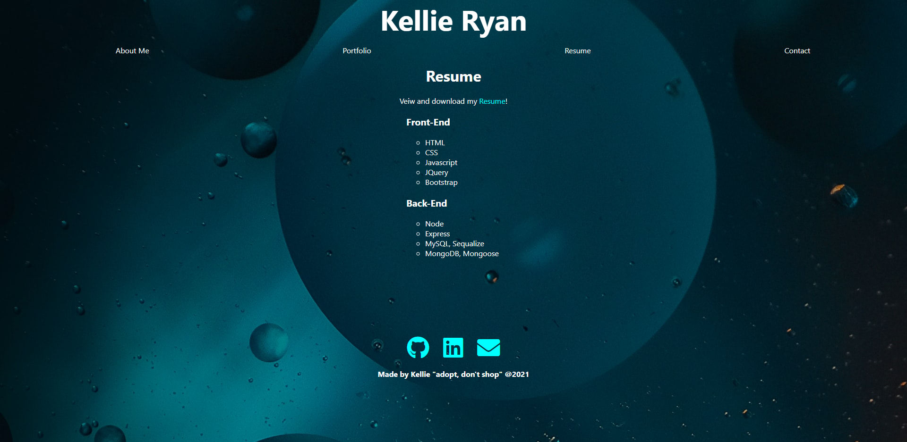

# React Profile

## Table of Contents

- [Description](#description)
- [Installation](#installation)
- [Links](#links)
- [Screenshots](#screenshots)

## Description

An app that showcases my work! Links to my Resume, GitHub, LinkedIn and contact details!

This app uses:
- React
- Yarn
- Node

## Installation

To Install this app onto your own computer:
* Clone the Repository
* Open up your terminal and change into the cloned folder
* Type "npm i" to install the dependancies
* Then lastly type "yarn start" or 'npm start' to start the site!

Otherwise just click on the 'deployed website' link in the Links Section to use the app!

## Links

* gitHub: https://github.com/Kel03-byte/react-profile
* Deployed website: https://kel03-byte.github.io/react-profile/

## Screenshots

About Me Page

Project Page

Resume Page

Contact Page
